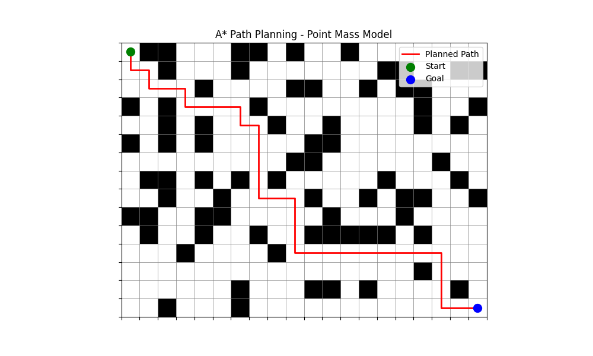

# Phase 1: Point Mass A* Path Planning 📍

这是自动泊车项目的第一阶段成果：**质点模型 A* 算法**。

## 🎯 阶段目标
本阶段的核心任务是搭建 A* 算法的基础框架，验证路径搜索逻辑的正确性。

### 简化假设
为了专注于算法逻辑，我们做出了以下简化：
1.  **车被视为一个点**（无长宽，无转弯半径）。
2.  **地图为二维栅格**（0 为可行，1 为障碍物）。
3.  **运动为 4 连通**（仅支持上下左右移动）。

## 📂 文件清单
- `node.py`: 定义 A* 节点的数据结构（g, h, f 值及父节点）。
- `map.py`: 提供 0/1 栅格地图（支持静态和随机生成）。
- `heuristic.py`: 计算欧几里得距离作为启发式代价值。
- `astar.py`: 核心搜索逻辑，包含节点更新机制。
- `visualize.py`: 基于 Matplotlib 的路径绘制工具。
- `main.py`: 程序入口。

## 📊 运行结果

下图展示了算法在包含随机障碍物的地图上规划出的最短路径（红色线条）：

## 🚸 存在的问题（Phase 2 的切入点）
1.  **路径紧贴障碍物**：质点模型导致路径没有安全余量。
2.  **路径存在直角弯**：不符合汽车的运动学约束。

---
*下一步计划：进入 [Phase 2: Inflated A*](../phase2_inflated_astar/)，解决安全余量问题。*
