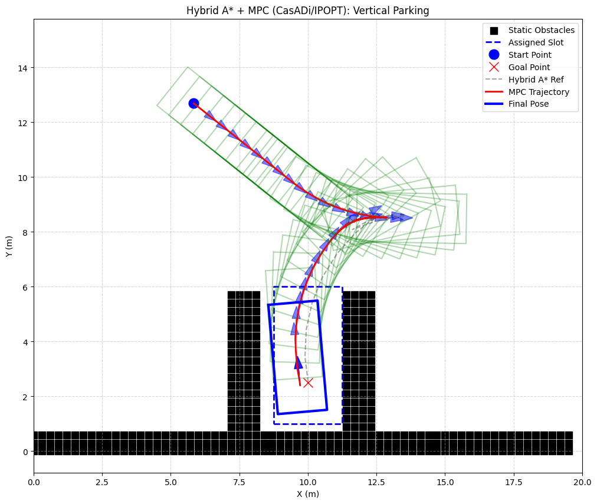
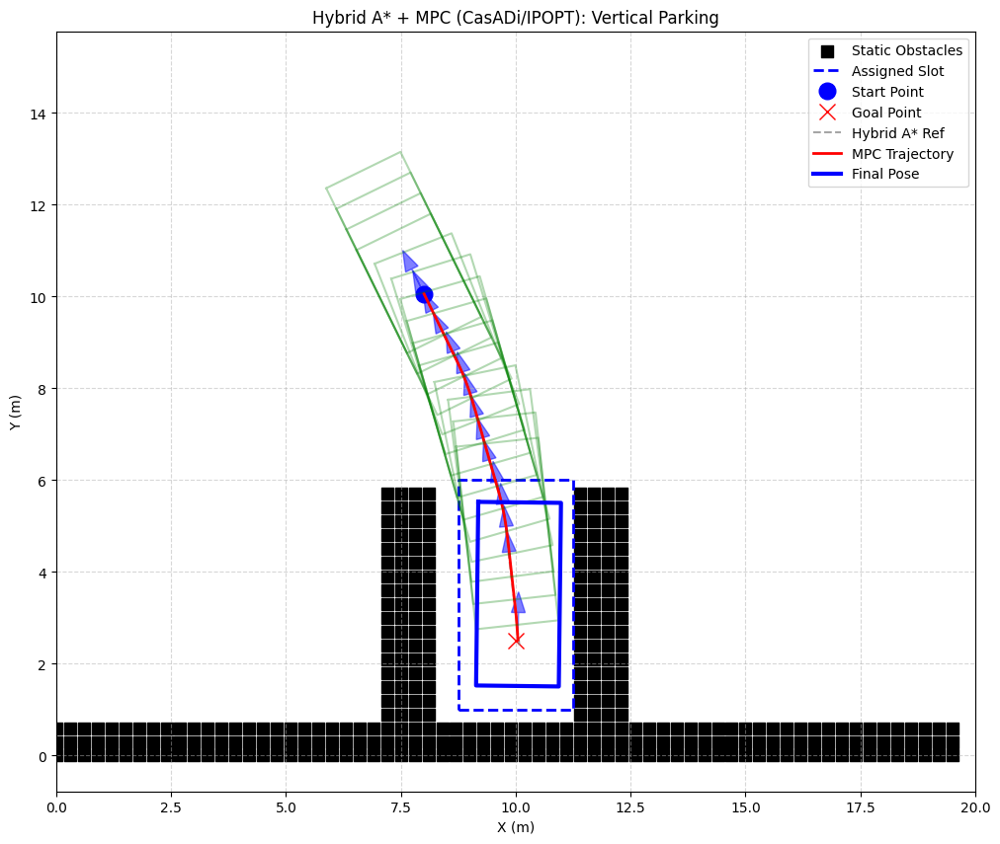
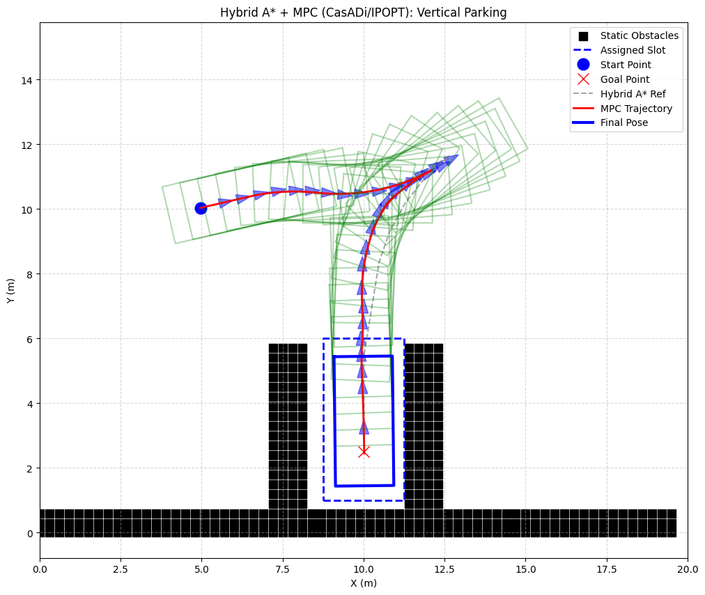
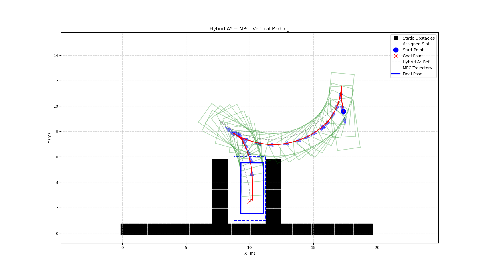
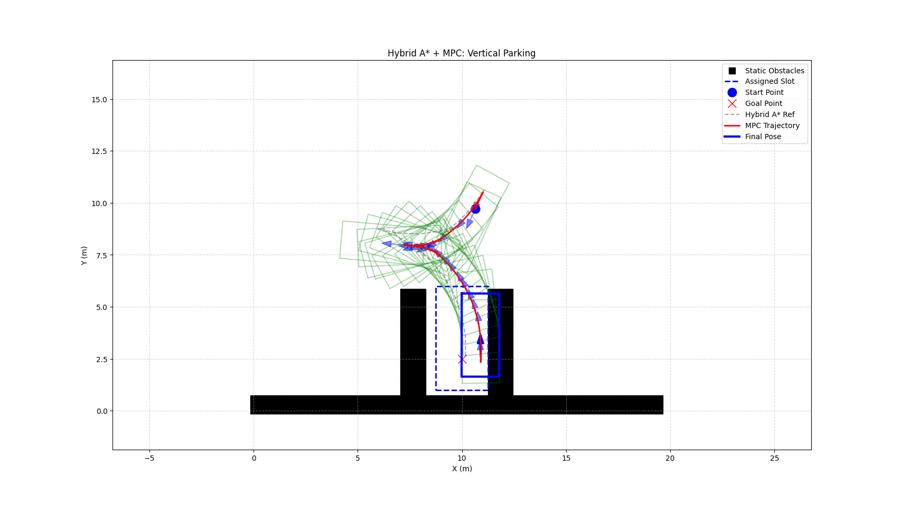

# Phase 4：Hybrid A* v2 —— 搜索、路径执行与 MPC 泊车闭环

这是自动泊车项目的第四阶段成果。Phase 4 不是简单“再加一点功能”，而是在 Phase 3 的 Hybrid A* 基础上，系统地补上了三件事：

- 搜索侧的继续探索
- 路径执行质量的提升
- 真正可用的跟踪控制器

[点击查看完整实验记录（含失败尝试、根本原因分析与最终结论）](./EXPERIMENT_LOG.md)

---

## 1. 这一阶段到底做了什么

到 Phase 3 为止，系统已经能在 SE(2) 空间里生成**运动学可行**的泊车路径，但还不够像一个完整系统，主要差在两点：

1. **搜索速度仍然偏慢**
   欧氏距离启发式在大状态空间里不够强。
2. **只有规划，没有真正执行**
   路径虽然存在，但没有控制器去稳定跟踪这条路径。

所以 Phase 4 的目标很明确：

- 继续尝试搜索加速
- 探索路径优化 / 平滑
- 加入 MPC 跟踪控制

这一阶段真正回答的问题是：

> 能不能把“搜出一条可行路径”升级成“车辆能稳定地把这条路径执行出来”？

---

## 2. 四个阶段的演进关系

| 维度 | Phase 1 | Phase 2 | Phase 3 | Phase 4 |
|------|---------|---------|---------|---------|
| 状态空间 | `(x, y)` 栅格 | `(x, y)` 栅格 | `(x, y, θ)` SE(2) | `(x, y, θ)` SE(2) |
| 运动模型 | 4 连通质点 | 8 连通质点 | 运动学自行车模型 | 运动学自行车模型 |
| 安全性 | 无 | C-space 膨胀 | 矩形车身碰撞检测 | 矩形车身碰撞检测 |
| 启发式 | 曼哈顿距离 | 欧几里得距离 | 欧几里得距离 | 欧几里得 + RS 近距离启发 |
| 路径后处理 | 无 | 无 | 无 | 尝试过平滑，但未并入主流程 |
| 控制器 | 无 | 无 | 无 | MPC（CasADi + IPOPT） |
| 最终能力 | 会找路 | 更安全地找路 | 能搜出可行驶路径 | 能较稳定地完成泊车执行 |

---

## 3. Phase 4 的核心结论

这一阶段一共认真探索了三条线：

### 3.1 搜索加速

试过的方向包括：

- `collision_checker.py` 的 numpy 向量化
- 用 Reeds-Shepp 曲线直接代替搜索
- 用 Reeds-Shepp 距离作为启发式
- 双向 Hybrid A* 搜索

**最终结论：**

- numpy 向量化在这里更慢，因为点数太少，固定开销更大
- RS 曲线不能直接代替搜索，因为它不知道障碍物
- RS 启发式方向上是对的，但整体加速效果很有限
- 双向 Hybrid A* 在 SE(2) 下会遇到朝向不兼容的拼接问题

所以这一条线没有带来决定性突破。真正的主瓶颈仍然是 SE(2) 状态空间本身。

### 3.2 路径优化 / 平滑

试过两种思路：

- 整条路径一起做梯度下降平滑
- 按换挡点切段后分别平滑

**最终结论：**

- 整体平滑会破坏姿态和换挡语义
- 分段平滑虽然能跑，但效果几乎为零

根本原因不是“平滑方法太差”，而是原始 Hybrid A* 路径点太稀疏。`dt=1.0` 导致相邻点间距太大，后处理几乎没有可发挥的空间。

### 3.3 MPC 跟踪控制

这条线最终成为 Phase 4 的主突破口。

最初先做的是基于 `scipy SLSQP` 的 MPC，经过多轮迭代后发现两个根本问题：

- 对初值过于敏感，容易卡局部最优
- 只查中心点碰撞时有盲区；改成 4 角点后又更难收敛

这暴露出一个结构性矛盾：

- 想要高成功率，就只能让代价函数简单一点
- 想要真实感知车身碰撞，就会让优化更难

最后的解决方案是：

> 从 `SLSQP + 中心点碰撞代价` 升级到 `CasADi + IPOPT + 4角点碰撞感知`

这一步才是真正让系统发生质变的地方。

但 Phase 4 也保留了一个尚未彻底解决的问题：

- 现在的碰撞仍然主要以**软惩罚**形式出现在 MPC 代价函数里
- 同时，Hybrid A* 输出给 MPC 的参考路径仍然偏“生硬”，本质上是离散运动原语积分出来的可行路径，而不是专门给控制器跟踪的高质量轨迹

这意味着：

- 即使整体成功率已经很高
- 在末端入位、换挡点、大曲率转向这些位置
- 仍然可能出现轻微擦边或轻微碰撞

所以后续改进不能只盯着“碰撞权重调大一点”，也不能只盯着“继续做整条路径平滑”，更合理的方向是：

- 前段继续由 Hybrid A* 负责全局绕障
- 最后入位段单独生成更平滑的轨迹
- 再交给 MPC 跟踪

这也是下一阶段值得尝试 intermediate pose + clothoid terminal segment 的原因。

---

## 4. 最终系统结构

Phase 4 最终采用的主流程如下：

```text
Hybrid A* 搜索参考路径
-> 路径插值加密
-> MPC 滚动优化
-> 输出连续控制量 (v, phi)
-> 车辆仿真执行
```

其中：

- Hybrid A* 负责给出一条运动学可行的参考路径
- 插值模块负责把稀疏路径加密，避免 MPC 抄近路
- MPC 负责把离散参考路径变成连续控制量

---

## 5. 主要模块说明

| 文件 | 职责 |
|------|------|
| `car_model.py` | 运动学自行车模型，负责状态更新和车身角点计算 |
| `collision_checker.py` | 车身边界采样碰撞检测 |
| `state_indexer.py` | 连续状态离散化与搜索剪枝 |
| `hybrid_astar.py` | Hybrid A* 核心，路径点中额外记录了速度方向 `v` |
| `reeds_shepp.py` | Reeds-Shepp 路径族实现，用于近距离启发式 |
| `path_smoother.py` | 梯度下降平滑器，已实现但未集成进最终主流程 |
| `mpc_controller.py` | 最终采用的 MPC 控制器，基于 CasADi + IPOPT |
| `main_vertical.py` | 垂直泊车主程序，含路径插值、MPC 仿真与可视化 |
| `main_parallel.py` | 侧方位停车主程序 |

---

## 6. 最终采用的 MPC 方案

### 控制目标

给定参考路径，每一步滚动优化未来 `N` 步控制量，输出连续的：

- 速度 `v`
- 转角 `phi`

### 代价函数

总代价由几部分组成：

- 位置误差
- 朝向误差
- 控制平滑项
- 障碍物碰撞惩罚（基于 4 角点）

### 最终参数

```text
N=5, dt=0.5
w_pos=5.0
w_theta=2.0
w_ctrl=0.1
w_obs=15.0
d_safe=0.5
```

### 求解器

- 建模：CasADi
- 优化器：IPOPT
- 梯度：自动微分
- 单步求解时间：约 `3ms`

---

## 7. 实验结果

### 7.1 SLSQP 阶段

SLSQP 版本已经能跑通闭环，但存在明显问题：

- 成功率约 `60%`
- 中心点碰撞检测存在盲区
- 起点姿态差时更容易卡死

### 7.2 CasADi + IPOPT 阶段

升级到 CasADi + IPOPT，并把碰撞感知提升到 4 角点后：

- 成功率：`10/10 = 100%`
- 碰撞次数：`0/10`

对比结果如下：

| 维度 | SLSQP 版 | CasADi + IPOPT 版 |
|------|---------|-------------------|
| 优化器 | `scipy SLSQP` | `CasADi + IPOPT` |
| 梯度 | 数值差分 | 自动微分 |
| 碰撞感知 | 中心点 | 4 角点 |
| 成功率 | `60% (6/10)` | `100% (10/10)` |
| 碰撞案例 | `2/10` | `0/10` |

---

## 8. 结果图

### CasADi + IPOPT 成功案例

|  |  |
|---|---|
| Trial 1：大弧度转向入位 | Trial 4：70 步完成，速度最快 |

|  |  |
|---|---|
| Trial 8：接近正向起步的困难案例 | Trial 9：远端起点仍能成功 |

### SLSQP 阶段的典型问题

|  |  |
|---|---|
| 中心点看似安全，但左侧角点碰撞 | 中心点看似安全，但右侧角点碰撞 |

这些失败图说明了一个关键问题：只看车中心点并不能代表整车真的安全。

---

## 9. 这一阶段真正说明了什么

Phase 4 最重要的结论不是“我用了 MPC”，而是下面这件事：

> 自动泊车系统真正困难的地方，不只是搜出一条运动学可行路径，而是把这条路径可靠地执行出来。

这一阶段里：

- 搜索加速没有成为决定性突破口
- 路径平滑没有成为决定性突破口
- 真正带来质变的是控制优化框架升级

同时还要补一句：

- 当前轻微碰撞问题并不只是碰撞项不是硬约束
- 也和参考路径太生硬、控制器末端跟踪压力过大直接相关

也就是说，Phase 4 的核心贡献不是继续压榨旧搜索框架，而是把“规划结果怎么落地执行”这件事真正补齐了。

---

## 10. 运行方法

```bash
cd autonomous-driving-learning-notes/code/astar-parking/phase4_hybrid_astar_v2

# 垂直泊车（含 MPC 跟踪）
python main_vertical.py

# 侧方位停车
python main_parallel.py
```

依赖：

- `numpy`
- `matplotlib`
- `scipy`
- `casadi`

安装 CasADi：

```bash
pip install casadi
```

---

## 11. 后续可继续推进的方向

1. 更强的搜索引导
   包括双启发式、RS analytic expansion、距离场辅助搜索等。
2. 更好的轨迹生成
   比如 clothoid 入位段、曲率连续轨迹。
3. 更严格的碰撞建模
   比如 optimization-based collision avoidance。
4. 更系统的实验对比
   把不同模块改动的贡献拆分得更清楚。

---

## 12. 一句话总结

Phase 4 从“能规划”推进到了“能较可靠地执行”。真正完成这次升级的关键，不是单纯换了几个参数，而是把控制器从 `SLSQP + 中心点碰撞代价` 升级成了 `CasADi + IPOPT + 4角点碰撞感知`。
