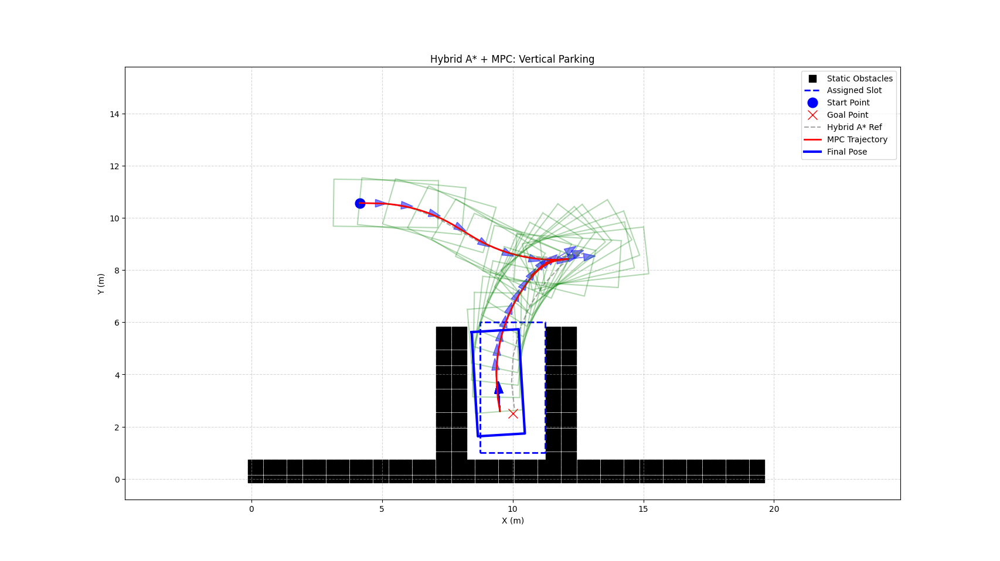
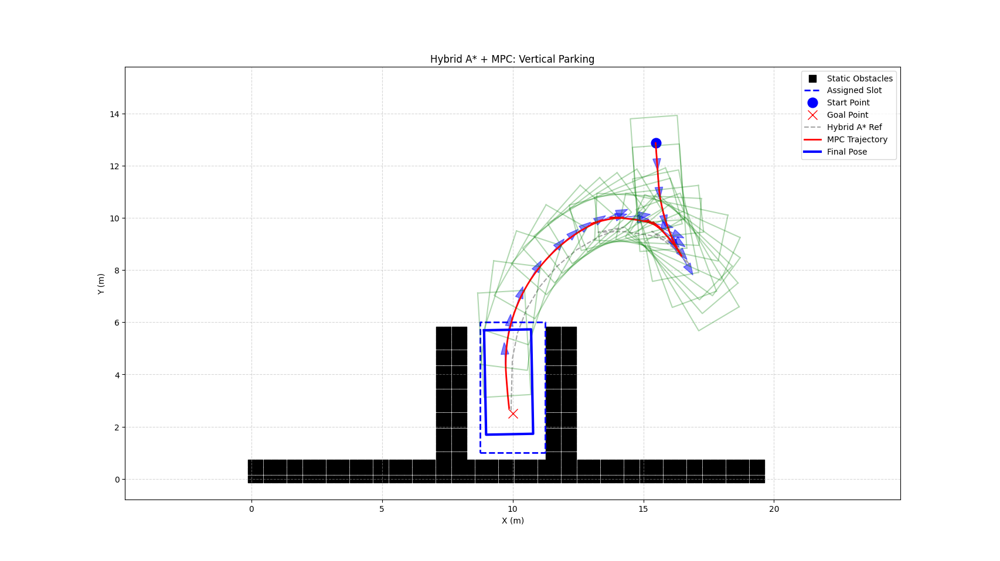

# Phase 4: Hybrid A* v2 — Search Acceleration + Path Smoothing + MPC Tracking 🚗

这是自动泊车项目的第四阶段成果：在 Phase 3 Hybrid A\* 基础上，系统性地探索了**搜索加速**、**路径平滑**和**MPC 轨迹跟踪控制**三个方向。

[点击查看详细实验记录（含所有失败尝试与根本原因分析）](./EXPERIMENT_LOG.md)

---

## 🎯 阶段目标

Phase 3 已实现运动学可行的 Hybrid A\* 泊车规划，但存在两个核心问题：
1. **搜索速度慢**：状态空间大，启发式不够精准
2. **无跟踪控制器**：只有规划路径，缺少让车辆实际执行的控制模块

本阶段任务 ：加速搜索、优化路径、加 MPC 控制器。

---

## 📈 四阶段演进对比

| 维度 | Phase 1 | Phase 2 | Phase 3 | Phase 4 |
|------|---------|---------|---------|---------|
| 状态空间 | $(x, y)$ 栅格 | $(x, y)$ 栅格 | $(x, y, \theta)$ SE(2) | $(x, y, \theta)$ SE(2) |
| 运动模型 | 4连通质点 | 8连通质点 | 运动学自行车模型 | 运动学自行车模型 |
| 安全性 | 无 | C-space 膨胀 | 矩形车身碰撞检测 | 矩形车身碰撞检测 |
| 启发式 | 曼哈顿距离 | 欧几里得距离 | 欧几里得距离 | RS 曲线距离（近距离切换） |
| 控制器 | 无 | 无 | 无 | MPC（SLSQP 滚动优化） |
| 路径执行 | 仿真走格子 | 仿真走格子 | 仿真走运动原语 | MPC 连续控制量跟踪 |

---

## 🔧 核心模块说明

### 新增模块

#### `reeds_shepp.py` — Reeds-Shepp 曲线启发式
实现完整 RS 路径族（CSC + CCC，覆盖 48 种前进/倒退组合），用于替换近距离的欧几里得启发式：

```python
h = rs_distance(next_state, self.goal, self.turning_radius) if euclidean < 5.0 else euclidean
```

**结论**：RS 启发式方向上更准确，但实际搜索速度提升极为有限（< 8%）。

#### 双向 Hybrid A\* 搜索（已尝试，已放弃）
从起点和终点同时展开搜索，理论上将搜索空间从 O(b^d) 降到 O(b^(d/2))。实现后发现相遇点出现路径折角——forward 树末端和 backward 树末端的 θ 方向几乎不可能自然对齐，直接拼接违反运动学约束。SE(2) 空间里双向搜索需要位置+朝向同时兼容，代码复杂度过高，最终放弃。

#### `path_smoother.py` — 路径平滑器（已实现，未集成）
梯度下降法，按换挡点切段，每段施加平滑力 + 障碍物排斥力。

**结论**：由于 Hybrid A\* `dt=1.0` 导致路径点稀疏（仅十几个点，相邻点为直线段），平滑效果几乎为零。文件保留但主流程不调用。

#### `mpc_controller.py` — MPC 轨迹跟踪控制器
给定参考路径，每步对未来 N 步做滚动优化，输出连续控制量 $(v, \varphi)$：

```
代价函数 J = Σ [w_pos·位置偏差² + w_theta·角度偏差² + w_obs·碰撞惩罚 + w_ctrl·控制平滑]
优化器：scipy SLSQP
约束：v ∈ [-1, 1],  φ ∈ [-0.4, 0.4]
最终参数：N=5, dt=0.5, w_pos=5.0, w_theta=2.0, w_ctrl=0.1, w_obs=10.0, d_safe=0.5
```

### 修改模块

#### `hybrid_astar.py`
- 路径点格式从 `(x, y, θ)` 改为 `(x, y, θ, v)`，记录每步前进/倒车方向，供 MPC 判断换挡
- 集成 RS 曲线启发式

#### `collision_checker.py`
- 尝试 numpy 向量化，测试后比纯 Python 更慢（点数少时 numpy 开销 > 收益），已回退

---

## 📂 文件清单

| 文件 | 职责 |
|------|------|
| `car_model.py` | 运动学自行车模型，SE(2) 积分，车身角点变换 |
| `collision_checker.py` | 车身边缘采样碰撞检测（纯 Python 版） |
| `state_indexer.py` | 连续状态离散化，搜索剪枝 |
| `hybrid_astar.py` | Hybrid A\* 核心，含 RS 启发式，路径带 v 符号 |
| `reeds_shepp.py` | RS 路径族完整实现（48 种），启发式距离计算 |
| `path_smoother.py` | 梯度下降路径平滑（已实现，未集成主流程） |
| `mpc_controller.py` | MPC 控制器，滚动优化，含碰撞惩罚距离场 |
| `main_vertical.py` | 垂直泊车主程序，含路径插值、MPC 仿真、可视化 |
| `main_parallel.py` | 侧方位停车主程序 |

---

## 🚀 运行方法

```bash
cd autonomous-driving-learning-notes/code/astar-parking/phase4_hybrid_astar_v2

# 垂直泊车（含 MPC 跟踪）
python main_vertical.py

# 侧方位停车
python main_parallel.py
```

依赖：`numpy`, `matplotlib`, `scipy`

---

## 📊 运行结果

### 成功案例 1：标准起点，完整倒入
MPC 轨迹（红线）紧贴 Hybrid A\* 参考路径（灰色虚线），顺利倒入车位，Final Pose 居中对齐。



### 成功案例 2：大弧度起点
起点位于地图右侧，需大角度转向，MPC 依然成功跟踪完成泊车，展示算法对不同起点的鲁棒性。



### 失败案例：碰撞盲区（系统性缺陷）
MPC 碰撞惩罚仅检测车辆**中心点**到障碍的距离，忽略车身宽度（1.8m）。倒车末段偏移 0.6m 时，中心点距障碍仍 > `d_safe`，惩罚不触发，但车身角点已越界。

| 碰左侧障碍 | 碰右侧障碍 |
|-----------|-----------|
|  |  |

两个方向都会碰，是系统性缺陷而非偶发。详见 [EXPERIMENT_LOG.md](./EXPERIMENT_LOG.md)。

---

## 📉 局限性与根本瓶颈

| 问题 | 原因 | 是否解决 |
|------|------|---------|
| 成功率约 60% | SLSQP 局部优化器，大角度起点初值不好就卡死 | 否 |
| 碰撞盲区 | 碰撞惩罚只查中心点，不感知车身宽度 | 否（改角点后成功率更低） |
| 路径平滑无效 | 路径点稀疏，无折角可平滑 | 放弃 |

---

## 🚸 下一步方向

1. **换 Pure Pursuit 控制器**：严格贴密集参考路径，天然继承 Hybrid A\* 的无碰撞性，预计成功率显著提升
2. **MPC 改用更强优化器**：如 CasADi + IPOPT，支持真正的碰撞约束而非惩罚项
3. **路径密化**：将 `dt` 从 1.0 降到 0.3，路径点增密后路径平滑才有意义

---

*本项目是自动驾驶学习系列的一部分。从 Phase 1 的简单寻路到 Phase 4 的 MPC 跟踪控制，逐步接近工业级泊车方案。*
