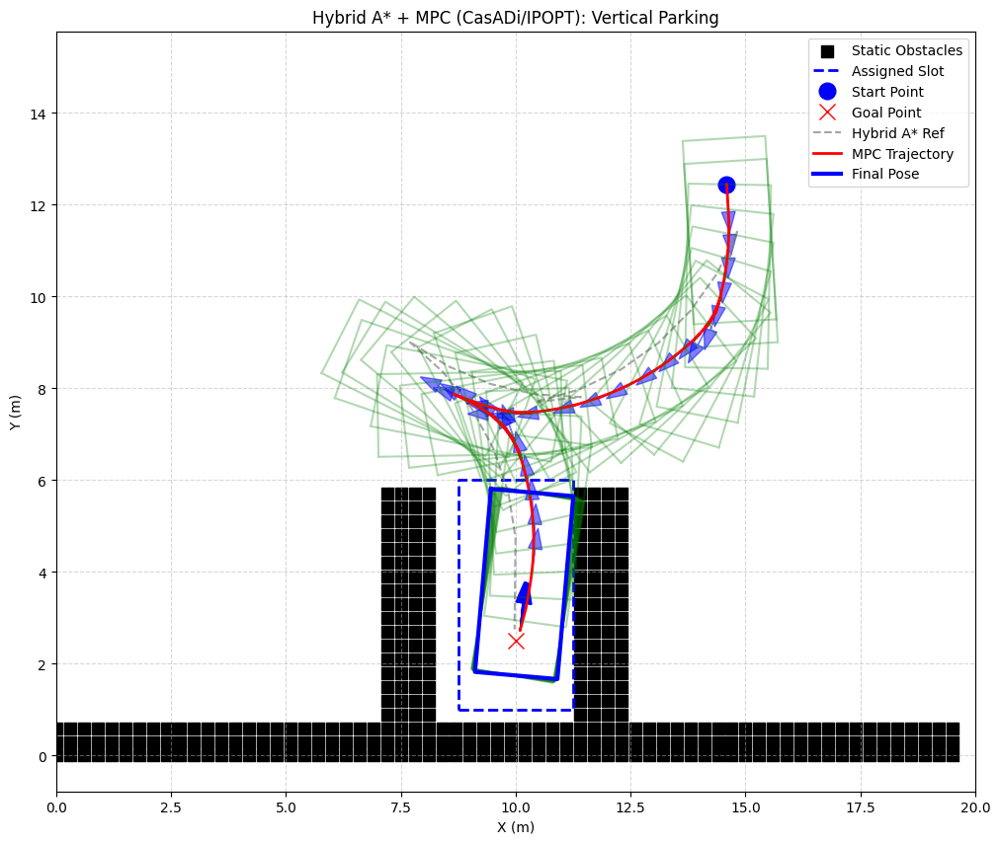
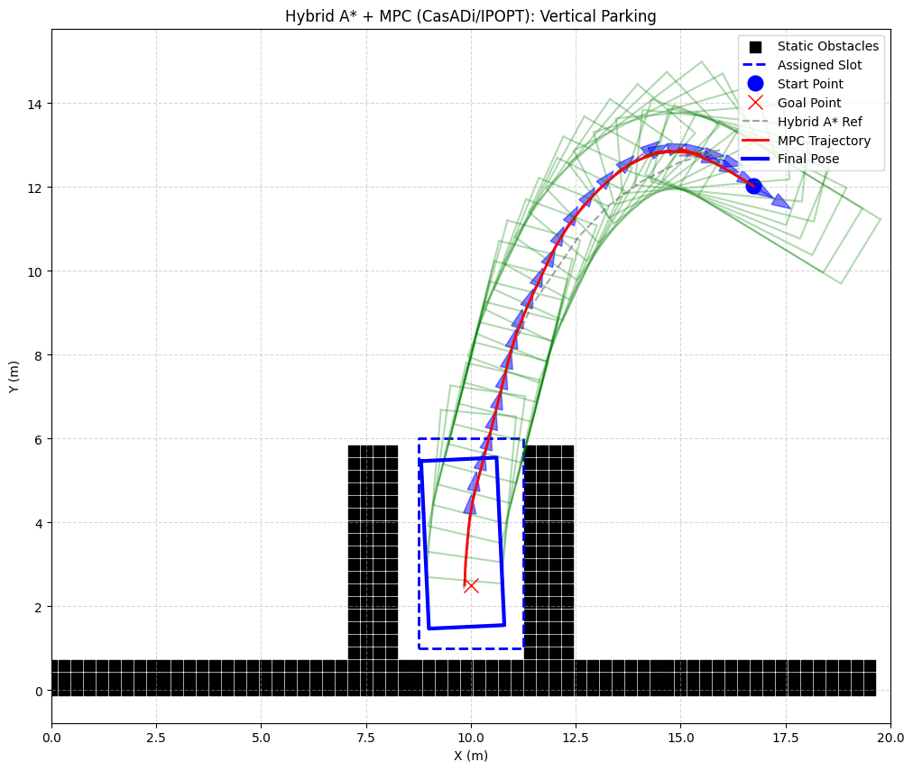

# Phase 5: Hybrid A* + MPC (CasADi/IPOPT) — Vertical Parking

Phase 5 在 Phase 4 基础上升级控制器：将 SLSQP 换为 CasADi + IPOPT，碰撞检测从中心点改为 4 角点，成功率从 60% 提升至 **100%（10/10）**。

---

## 与 Phase 4 的核心区别

| 维度 | Phase 4 | Phase 5 |
|------|---------|---------|
| 优化器 | scipy SLSQP | CasADi + IPOPT |
| 梯度计算 | 数值差分 | 自动微分 |
| 碰撞检测 | 中心点 | 4 角点 |
| NLP 构建 | 每步重建 | 预编译一次 |
| 成功率（10次） | 60% | **100%** |
| 碰撞案例 | 2/10 | **0/10** |

---

## 核心改进原理

### 1. IPOPT 替代 SLSQP
SLSQP 是局部梯度法，初值不好就卡死。IPOPT 使用内点法，收敛域更宽，对初值不敏感。

### 2. 4 角点碰撞检测
Phase 4 只查车辆中心点距障碍距离，车宽 1.8m 被完全忽略。倒车偏 0.6m 时中心点仍安全，但角点已越界。Phase 5 同时检查前左/前右/后左/后右 4 个角点：

```python
for ldx, ldy in [(L_h,W_h),(L_h,-W_h),(-L_h,W_h),(-L_h,-W_h)]:
    cx = x + ldx*ct - ldy*st
    cy = y + ldx*st + ldy*ct
    penalty += fmax(0, d_safe - dist(cx, cy))^2
```

### 3. 预编译 NLP
CasADi 在初始化时把整个 N 步优化问题编译为符号计算图，每步只传入参数求解，不重建符号图，速度约 3ms/步。

---

## 运行结果（10次随机起点）

| Trial | 起点角度 | 步数 | 结果 |
|-------|---------|------|------|
| 1 | 273° | 228 | ✅ |
| 2 | 81° | 81 | ✅ |
| 3 | 286° | 108 | ✅ |
| 4 | 116° | 70 | ✅ |
| 5 | 321° | 161 | ✅ |
| 6 | 327° | 166 | ✅ |
| 7 | 297° | 134 | ✅ |
| 8 | 13° | 155 | ✅ |
| 9 | 329° | 143 | ✅ |
| 10 | 266° | 187 | ✅ |

**成功率：10/10 = 100%，碰撞：0/10**

### 成功案例 1（标准起点）


### 成功案例 2（远端起点 θ=329°）


---

## 文件清单

| 文件 | 职责 |
|------|------|
| `car_model.py` | 运动学自行车模型 |
| `collision_checker.py` | 车身边缘碰撞检测 |
| `state_indexer.py` | 连续状态离散化 |
| `hybrid_astar.py` | Hybrid A* 规划器（含 RS 启发式，路径带 v 符号） |
| `reeds_shepp.py` | RS 路径族实现 |
| `mpc_controller.py` | CasADi+IPOPT MPC 控制器，4角点碰撞惩罚 |
| `main_vertical.py` | 主程序：随机起点 → A* 规划 → MPC 跟踪 → 可视化 |

---

## 运行方法

```bash
cd autonomous-driving-learning-notes/code/astar-parking/phase5_pure_pursuit

# 单次运行
python main_vertical.py

# 批量（指定 trial 编号）
python main_vertical.py 1
python main_vertical.py 2
```

依赖：`numpy`, `matplotlib`, `casadi`（`pip install casadi`）
