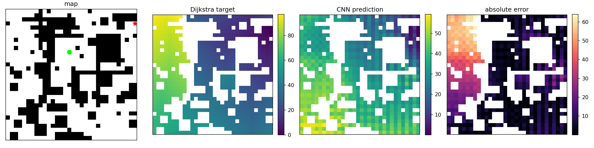

# Phase 6 实验记录：Neural A* 简化复现

Phase 6 先复现 learning heuristic 的 2D toy 版本：

```text
随机 2D 栅格地图
-> Dijkstra 反向搜索生成 cost-to-go 标签
-> CNN 学习 heuristic map
-> 后续接回 A* 对比 expanded nodes
```

当前阶段不考虑车辆姿态、转弯半径、倒车、车身碰撞和 SE(2) 运动学约束。

---

## 0. 实验思考

### 0.1 为什么先做 2D toy

论文中有 2D toy 和更接近 continuous / SE(2) 的设置。当前先做 2D toy，是为了把 learning heuristic 的最小闭环跑通：

```text
map -> Dijkstra label -> CNN heuristic -> A*
```

2D toy 的优点是标签清楚。状态只有 `(x, y)`，Dijkstra 从 goal 反向搜索得到的 cost-to-go map 可以作为该问题下的真实 `h*(x, y)`。

这一步不是最终泊车版本。泊车问题最终需要考虑：

```text
(x, y, theta)
车辆不能侧移
不能原地转向
最小转弯半径
倒车/转向代价
车身矩形碰撞
```

所以普通 2D Dijkstra 不能直接作为泊车 Hybrid A* 的最优启发式。真正贴合泊车的标签应该来自与 Hybrid A* 一致的状态空间、动作集合和代价函数。

### 0.2 和 Phase 5 的关系

Phase 5 已经用 MLP 学过 Hybrid A* 成功路径上的 `cost_to_go`：

```text
[x, y, sin(theta), cos(theta), goal_x, goal_y, sin(goal_theta), cos(goal_theta)]
-> cost_to_go
```

Phase 5 的优点是标签来自 Hybrid A* 成功路径，包含车辆运动学和倒车/转向影响。问题是输入没有地图，模型不能真正理解障碍物结构。

Phase 6 补的是地图输入：

```text
obstacle map + start map + goal map
-> heuristic map
```

当前先在 2D toy 中做 CNN heuristic，后续再考虑迁移回泊车。

---

## 1. 数据集生成

脚本：

```text
generate_grid_dataset.py
```

数据内容：

```text
inputs:  (N, 3, 32, 32)
targets: (N, 1, 32, 32)
masks:   (N, 1, 32, 32)
maps:    (N, 32, 32)
starts:  (N, 2)
goals:   (N, 2)
```

`inputs` 三个通道：

```text
0: obstacle map
1: start map
2: goal map
```

`targets` 是 Dijkstra 从 goal 反向搜索得到的 cost-to-go map。  
`masks` 用来让 loss 只在 free 且 reachable 的格子上计算。

地图障碍物由三类元素混合生成：

```text
随机矩形障碍 + 随机散点/小块障碍 + 横竖短墙障碍
```

正式数据集：

```text
num samples: 500
map size: 32 x 32
mean obstacle ratio: 0.393
```

遇到的问题：

```text
第一版障碍物只用随机矩形，地图过于规则，大多成块出现。
```

调整：

```text
改成随机矩形 + 散点/小块 + 短墙混合生成，让地图更随机、更接近绕行场景。
```

样例：


---

## 2. A* Baseline

脚本：

```text
astar_baseline.py
```

当前使用 4 联通移动：

```text
上、下、左、右；每步代价 1.0
```

对比三种 heuristic：

```text
Manhattan heuristic
Euclidean heuristic
Dijkstra true heuristic
```

小规模测试结果：

```text
manhattan heuristic:
success: 5/5
mean expanded nodes: 137.60
mean generated nodes: 169.40
mean path length: 32.40

euclidean heuristic:
success: 5/5
mean expanded nodes: 176.60
mean generated nodes: 200.20
mean path length: 32.40

dijkstra heuristic:
success: 5/5
mean expanded nodes: 74.20
mean generated nodes: 108.40
mean path length: 32.40
```

结论：

```text
Dijkstra true heuristic 展开节点最少，是当前 2D toy 问题里的最强 baseline。
```

expanded node 的含义：

```text
从 open list 中取出，并检查过邻居的节点。
```

它不是 final path。很多 expanded nodes 最后不会出现在路径里，因为 A* 在找到最终路径之前，需要尝试多个可能方向。

expanded nodes 可视化：


图中：

```text
黑色 = 障碍物
白色 = 未展开自由空间
灰色 = expanded nodes
蓝线 = final path
绿色 = start
红色 = goal
```

关于 Dijkstra true heuristic：

```text
如果已经有完整 Dijkstra cost-to-go map，
可以直接从 start 沿 h 变小的方向走到 goal。
```

但这张 Dijkstra map 本身不是免费的。为了得到它，Dijkstra 已经从 goal 反向搜索了大量区域。论文训练 CNN 的目的就是让网络近似这张 cost-to-go map，避免每次都完整运行 Dijkstra。

同时，CNN prediction 不一定完全准确。如果直接沿 CNN 的下降方向走，可能遇到局部错误或走偏。因此 learned heuristic 更适合先接回 A*，由 open list 保持搜索稳定性。

---

## 3. CNN Heuristic

脚本：

```text
train_grid_cnn.py
```

输入：

```text
obstacle map + start map + goal map
```

输出：

```text
predicted cost-to-go map
```

网络结构：

```text
Conv2d + ReLU 堆叠
dilated convolution 扩大感受野
最后输出 1 通道 heuristic map
```

训练设置：

```text
dataset: 500 samples
train/val/test: 350/75/75
loss: masked MSE
epochs: 60
device: CPU
target scale: 112.00
```

训练结果：

```text
epoch 001, train loss 0.0271, val loss 0.0256, val MAE 14.2311
epoch 020, train loss 0.0109, val loss 0.0110, val MAE 7.9518
epoch 040, train loss 0.0068, val loss 0.0114, val MAE 8.2158
epoch 060, train loss 0.0023, val loss 0.0116, val MAE 7.8319

test loss: 0.0103
test MAE: 7.2525
```

遇到的问题：

```text
第一版普通浅层 CNN 的 MAE 较大，说明只看局部不够。
```

调整：

```text
加入 dilated convolution 扩大感受野。
```

这里的感受野指的是：预测某个格子的 cost-to-go 时，网络能参考输入地图的范围。dilation 让卷积隔着格子看，在参数量不明显增加的情况下扩大视野。

CNN 预测可视化：



图中：

```text
map = 输入地图
Dijkstra target = 真实 cost-to-go 标签
CNN prediction = CNN 预测 heuristic map
absolute error = |CNN prediction - Dijkstra target|
```

当前结论：

```text
CNN 已经学到 Dijkstra 距离场的大趋势，但局部误差仍明显。
当前还只是离线预测结果，尚未证明 learned heuristic 能减少 A* expanded nodes。
```

误差观察：

```text
远离 goal 的区域通常误差更大。
```

原因：

- 远距离 cost-to-go 更依赖全局绕路结构
- 障碍物和短墙会导致真实路径大幅绕行
- 当前 CNN 还不能完全理解全局拓扑
- 远距离样本的绝对误差空间更大

---

## 4. 当前进度

已完成：

```text
1. 2D 随机地图数据生成
2. Dijkstra cost-to-go 标签生成
3. Manhattan / Euclidean / Dijkstra A* baseline
4. expanded nodes 可视化
5. 第一版 CNN heuristic 训练
6. CNN prediction vs Dijkstra target 可视化
```

下一步：

```text
把 CNN prediction 接回 A*，
对比 Manhattan / Euclidean / Dijkstra / CNN learned heuristic 的 expanded nodes。
```
