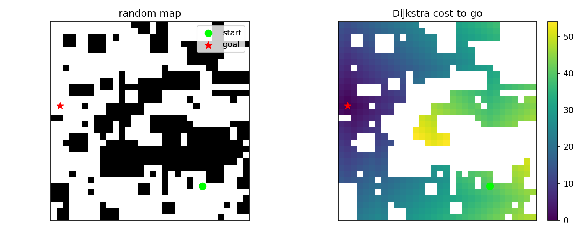
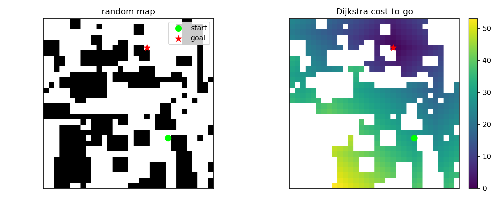
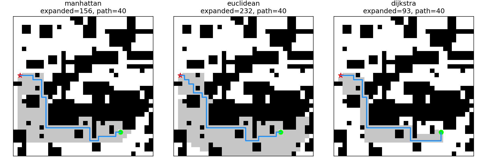

# Phase 6 实验记录：Neural A* 简化复现

这份记录用于保存 Phase 6 的实验过程、关键想法、数据生成方式和后续结果。

Phase 6 当前目标是先复现论文中 learning heuristic 的最小闭环：

```text
随机 2D 栅格地图
-> Dijkstra 反向搜索生成 cost-to-go 标签
-> CNN 学习 heuristic map
-> learned heuristic 接回 A*
-> 对比搜索效率
```

---

## 1. 当前阶段：2D toy 数据集生成

当前先做论文里的简化 2D toy 版本，不直接做泊车 SE(2) continuous domain。

原因：

- 2D toy 的状态只有 `(x, y)`，更容易检查
- Dijkstra 标签清楚，可作为 2D 网格问题里的真实 `h*(x, y)`
- CNN 输入输出结构简单，适合先跑通论文核心流程
- 后续再迁移到 Hybrid A* 泊车问题

当前暂时不考虑：

- 车辆姿态 `theta`
- 车辆不能侧移、不能原地转向
- 最小转弯半径
- 车身矩形碰撞
- 倒车和转向惩罚
- SE(2) heuristic volume

---

## 2. 数据格式

脚本：

```text
generate_grid_dataset.py
```

每条样本包含：

```text
inputs:  (3, 32, 32)
targets: (1, 32, 32)
masks:   (1, 32, 32)
```

`inputs` 有 3 个通道：

```text
channel 0: obstacle map
channel 1: start map
channel 2: goal map
```

`targets` 是 Dijkstra 从 goal 反向搜索得到的 cost-to-go map：

```text
每个可达 free cell 到 goal 的最短距离
```

`masks` 表示哪些位置参与训练：

```text
free 且 reachable 的格子 = 1
障碍物或不可达区域 = 0
```

---

## 3. 地图生成方式

第一版地图只用了随机矩形障碍物，视觉上过于规则，障碍物大多成块出现。

因此当前版本改成三类障碍物混合生成：

```text
1. 随机矩形障碍
2. 随机散点 / 小块障碍
3. 横竖短墙障碍
```

默认参数：

```text
--num-rectangles 10
--num-dots 80
--num-walls 8
--min-free-ratio 0.45
```

这样地图会更随机、更密，也更容易产生绕行结构。

当前一次小规模测试：

```text
num_samples: 5
map size: 32 x 32
mean obstacle ratio: 0.402
inputs shape: (5, 3, 32, 32)
targets shape: (5, 1, 32, 32)
masks shape: (5, 1, 32, 32)
```

---

## 4. 预览样例

下面两张图来自当前数据生成脚本的预览结果。

每张图左侧是随机障碍地图：

- 黑色区域表示障碍物
- 白色区域表示可通行区域
- 绿色圆点表示 start
- 红色星号表示 goal

每张图右侧是 Dijkstra cost-to-go map：

- goal 附近距离最小
- 离 goal 越远，颜色对应的 cost 越大
- 障碍物和不可达区域不参与训练

### 4.1 样例 001



### 4.2 样例 002



---

## 5. 当前判断

当前数据生成阶段已经完成第一版闭环：

```text
随机地图
-> 随机 start / goal
-> 检查可达性
-> Dijkstra 生成 cost-to-go 标签
-> 保存 CNN 输入、标签和 mask
-> 保存地图预览图
```

这个阶段还没有训练 CNN。

当前已经开始写普通 2D A* baseline：

```text
A* + Manhattan heuristic
A* + Euclidean heuristic
A* + Dijkstra true heuristic
```

这样后面 CNN learned heuristic 训练出来后，才能比较：

```text
传统 heuristic 展开多少节点
learned heuristic 展开多少节点
路径长度有没有变差
搜索时间有没有变化
```

---

## 6. 2D A* baseline

脚本：

```text
astar_baseline.py
```

当前 A* 使用的是 4 联通移动：

```text
上、下、左、右
```

每一步移动代价都是：

```text
1.0
```

因此这个 2D toy 问题里的最短路径长度，就是从 start 到 goal 需要走多少个格子步。

这个脚本读取数据集里的：

```text
maps
starts
goals
targets
```

然后在同一批地图上分别运行三种 A*：

```text
1. A* + Manhattan heuristic
2. A* + Euclidean heuristic
3. A* + Dijkstra true heuristic
```

其中：

```text
Dijkstra true heuristic = targets[i, 0]
```

也就是数据生成阶段从 goal 反向搜索得到的真实 cost-to-go map。

在 2D toy 问题里，Dijkstra true heuristic 是最强 baseline，因为它已经知道每个格子到 goal 的真实最短距离。

### 6.1 小规模测试结果

使用 5 个测试样本：

```bash
python3 astar_baseline.py --dataset datasets/test_grid2d_heuristic.npz
```

结果：

```text
manhattan heuristic:
success: 5/5
mean planning time: 0.001254s
mean expanded nodes: 137.60
mean generated nodes: 169.40
mean path length: 32.40

euclidean heuristic:
success: 5/5
mean planning time: 0.001732s
mean expanded nodes: 176.60
mean generated nodes: 200.20
mean path length: 32.40

dijkstra heuristic:
success: 5/5
mean planning time: 0.000717s
mean expanded nodes: 74.20
mean generated nodes: 108.40
mean path length: 32.40
```

### 6.2 当前结果解释

三种 heuristic 都找到了路径：

```text
success: 5/5
```

三种 heuristic 的平均路径长度一样：

```text
mean path length: 32.40
```

说明它们找到的都是同样长度的最短路径。

但展开节点数不同：

```text
Manhattan expanded: 137.60
Euclidean expanded: 176.60
Dijkstra expanded: 74.20
```

这说明：

```text
Dijkstra true heuristic 最接近真实 cost-to-go，因此搜索最省节点。
```

这一步的意义是：

```text
后面 CNN learned heuristic 的目标不是随便预测一个距离图，
而是尽量接近 Dijkstra true heuristic 的搜索效果。
```

如果 CNN 接回 A* 后展开节点数接近 Dijkstra true heuristic，并且明显少于 Manhattan / Euclidean，就说明 learned heuristic 有价值。

### 6.3 expanded nodes 可视化

为了更直观看到不同 heuristic 对搜索方向的影响，当前 baseline 脚本会保存一张对比图：

```text
results/baseline_expanded_nodes.png
```

图中含义：

- 黑色：障碍物
- 白色：未展开的自由空间
- 灰色：A* 已经 expanded 的节点
- 蓝色线：最终路径
- 绿色圆点：start
- 红色星号：goal

当前测试样例：



从图里可以看到：

```text
Dijkstra true heuristic 的灰色区域明显更少，
说明它更清楚哪些节点真的更接近 goal，
因此 A* 不需要向无关方向展开太多。
```

### 6.4 为什么不直接沿 Dijkstra 距离场走

这里有一个重要问题：

```text
如果已经有了 Dijkstra true heuristic，
为什么不直接从 start 沿着 h 变小的方向走到 goal？
```

在当前 2D toy 问题中，这确实可以做到。

因为 Dijkstra true heuristic 本质上是：

```text
h*(x, y) = 当前格子到 goal 的真实最短距离
```

如果动作是 4 联通，并且每一步代价都是 `1.0`，那么可以这样走：

```text
当前格子 h = 20
-> 选择邻居里 h = 19 的格子
-> 选择邻居里 h = 18 的格子
-> ...
-> h = 0，到达 goal
```

这相当于沿着 cost-to-go map 做离散梯度下降。

如果 `h*` 是真实 Dijkstra 距离场，这样得到的路径就是最短路径。

但是问题在于：

```text
Dijkstra true heuristic 不是免费来的。
```

为了得到这张完整的 cost-to-go map，Dijkstra 已经从 goal 反向搜索了大量区域，甚至可能接近整张地图。

#### 方式一：先 Dijkstra，再沿距离场走

```text
goal 反向 Dijkstra
-> 得到整张 cost-to-go map
-> 从 start 沿 h 下降走到 goal
```

优点：

- 路径提取很快
- 路径是最短路径
- 适合同一张地图、同一个 goal、多次查询不同 start

缺点：

- 前面已经付出了 Dijkstra 全局搜索成本
- 如果只查一次 start-goal，可能不划算

#### 方式二：A*

```text
从 start 出发
-> 用 h 引导搜索方向
-> 只展开必要区域
```

优点：

- 不一定需要展开整张地图
- 对单次 start-goal 查询通常更省
- heuristic 不完美时仍然能通过 open list 保持搜索稳定

缺点：

- 需要一个好的 heuristic
- heuristic 差时会展开很多无关节点

论文训练神经网络的意义就在这里：

```text
Dijkstra true heuristic 是老师；
CNN learned heuristic 是学生。
```

训练时：

```text
用 Dijkstra 生成标签。
```

测试或规划时：

```text
用 CNN 快速预测 heuristic map。
```

目标是：

```text
不用每次真的跑完整 Dijkstra，
也能得到接近 Dijkstra 的搜索引导。
```

但是 CNN 预测出来的 heuristic 不一定完全准确。

如果直接沿 CNN heuristic 的下降方向走，可能会遇到：

- 预测误差导致走偏
- 局部低谷
- 周围邻居看起来都不更小
- 路径碰到障碍后无法恢复

所以 learned heuristic 更适合先接回 A*：

```text
A* 保留 open list；
如果某个方向预测错了，还可以回退并继续搜索其他候选节点。
```

当前结论：

```text
真实 Dijkstra 距离场可以直接生成路径；
但真实 Dijkstra 距离场生成成本高；
CNN 预测的距离场不够可靠；
所以论文选择把 learned heuristic 放进 A*，而不是直接沿梯度走。
```
